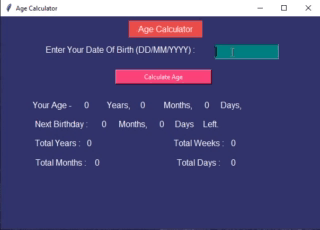

# INSTRUCTIONS
This is an GUI tool for calculating your age.


## To Run The App

```python
python AgeCalculator.py
```

- Enter your date of birth in dd/mm/yyyy format
- click Calculate Age button

## Technolgy Used 
- python
- tkinter module in python

## Output
