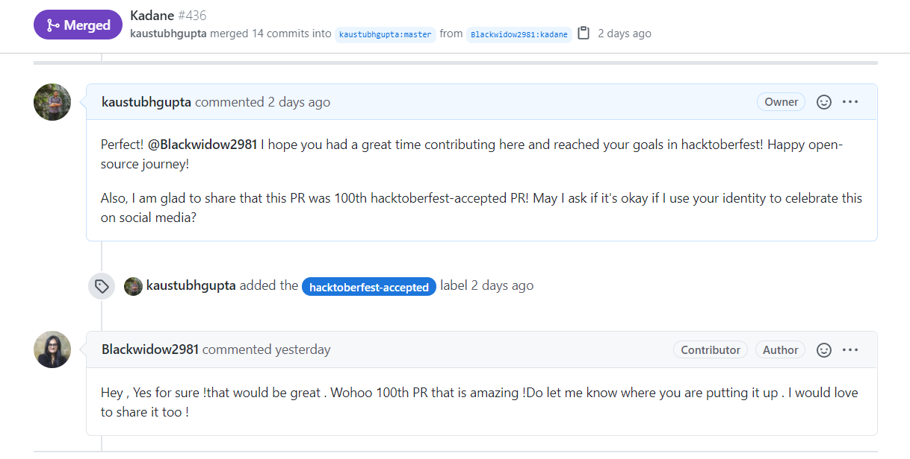

<h1>Hacktober Fest</h1>

Voila!
🙅🏼‍♂️Hacktoberfest is open to everyone in our global community. Whether you’re new to development, a student, long-time contributor, event host, or company of any size, you can help drive the growth of open source and make positive contributions to an ever-growing community. All backgrounds and skill levels are encouraged to complete the challenge.🙅🏼‍♂️

## Instructions 🙅🏼 🙅🏼‍♂️

-   If you are totally new to this culture then head over to this [guide](CONTRIBUTING.md) where everything has been explained in detail.
-   Look at the current issues.
-   If you are interested in any of them then comment "I would like to contribute in this"
    **Note: Issues are assigned on a first come first basis, do check if the issue or language implementation is not claimed by anyone else**
-   Issues are assigned on a first-come basis.
-   If you want to work on anything you have in mind then create an issue for that, tag me and then **wait for it be to be assigned to you.**
-   **Do not make a Pull request until you are assigned that specific issue.**

## Code I expect (for everyone):

-   It should be properly formatted
-   Add relevant comments explaining what the code is all about.
-   Please use proper naming for variables, do not use i,j,k,x,y,z. The variable name should be self-explanatory.
-   Use proper names for your files.
-   **Do all your changes in your forked repository branch and not in the master branch until asked.**
-   **We will reject any pull request which looks like spammy or just to have +1 in the counter, so contribute quality code here!**
-   As per the guidlines of Hacktoberfest, we will not merge any **plagiarised** code or any type of **fishy** code.

## 👑 👑 Hurray!!! You just got closer to completing your hacktoberfest challenge. 😃

## Happy?? Do Star ⭐ this Repo. 🤩

## Milestones 2020!

### 100th 'hacktoberfest-accepted' pull request
We have successfully merged our 100th 'hacktoberfest-accepted' pull request! This pull request was made by @Blackwidow2981. 

### 100th Repository Contributor

If you have any concern, then read this [code of conduct](CODE_OF_CONDUCT.md)
